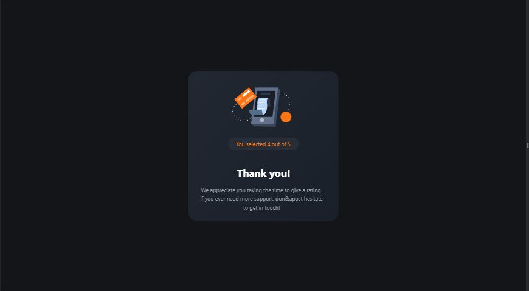
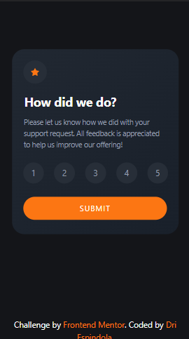
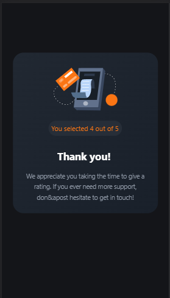

# Frontend Mentor - Product preview card component solution

This is a solution to the [Product preview card component challenge on Frontend Mentor](https://www.frontendmentor.io/challenges/product-preview-card-component-GO7UmttRfa). Frontend Mentor challenges help you improve your coding skills by building realistic projects. 

## Table of contents

- [Overview](#overview)
  - [The challenge](#the-challenge)
  - [Screenshots](#screenshots)
  - [Links](#links)
- [My process](#my-process)
  - [Built with](#built-with)
  - [Overview](#overview)
  - [Useful resources](#useful-resources)
- [Author](#author)
- [Acknowledgments](#acknowledgments)

## Overview

### The challenge

Users should be able to:

- View the optimal layout depending on their device's screen size
- See hover and focus states for interactive elements

### Screenshots

### Links

- Solution URL: [Github](https://github.com/driespindola/interactive-rating-component)
- Live Site URL: [Vercel](https://interactive-rating-component-gamma-ivory.vercel.app/)

## My process

### Built with

- Mobile-first workflow
- [React](https://reactjs.org/) - JS library
- [Typescript](https://www.typescriptlang.org/) - JS Library
- [Next.js](https://nextjs.org/) - React framework
- [Tailwind CSS](https://tailwindcss.com/) - For styles

### Overview

This challenge was completed utilizing TypeScript for data storage and prop passing to a newly created component. In addition to the core requirements of the challenge, I incorporated keyframes to enhance the visual transition between the main page and the 'thank you' page, providing a more aesthetically pleasing user experience.

### Useful resources

- [Chat GPT](https://chat.openai.com/) - ChatGPT is an artificial intelligence tool that has assisted me when I encountered difficulties with code. It is important to note that it should only be utilized when one has a fundamental understanding of the coding process.
- [W3Schools](https://www.w3schools.com/) - "Please provide a comprehensive list of commands across various programming languages, along with corresponding examples. I utilize as a reference in instances where I have forgotten or lack knowledge of specific commands."

## Author

- Frontend Mentor - [@driespindola](https://www.frontendmentor.io/profile/driespindola)
- Twitter - [@_driespindola](https://twitter.com/_driespindola)
